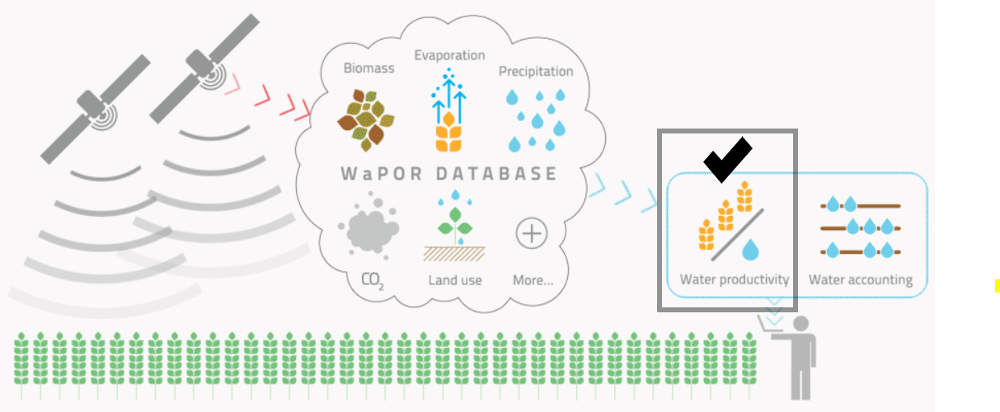
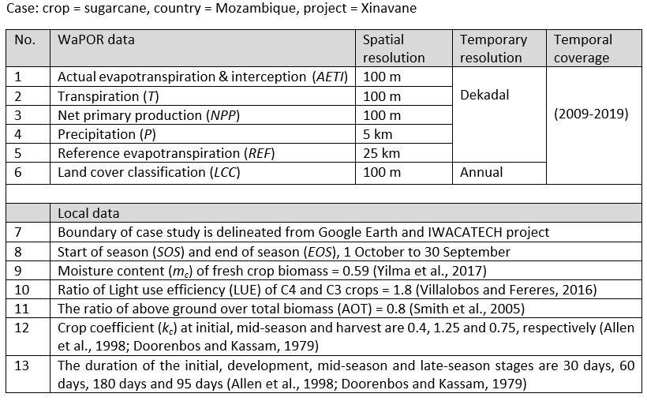

#  Standardized protocol for the land and water productivity analyses using WaPOR
**Water Productivity Improvement in Practice (Water-PIP)** 
 **Prepared by IHE Delft**
 **June 2020**

Authors:
* Abebe Chukalla (a.chukalla@un-ihe.org)
* Marloes Mul
* Poolad Karimi

With contributions from:
* Bich Tran
* Quan Pan
* Solomon Seyoum

# 1	Introduction  
## 1.1	Importance 
Land and water productivity is a measure of gains per unit of resource use (Zwart and Bastiaanssen, 2004). The gain can be described as biophysical, economic or social benefits; and the resource use refers to water use, or land. Water use can be consumption or supply, which can also be characterized as green water (effective rainfall) or blue water (effective irrigation). 

Productivity topic is interest of various stakeholders from farmer or irrigation manager to policy makers with various objectives. Farmers are interested to optimise the benefit generated per unit of resource use, i.e. land. While the top priority of the river basin authority is to allocate water resources in equitable, efficient and sustainable manner between different water uses/ users. Thus, at river basin level, the interest is to optimise productivity at river basin level while maintaining equity and sustainability as core values. Policy makers are often interested to increase employment and the overall production and thus national income.  

## 1.2	Protocol: objectives, scope and target audience
The protocol is aimed at guiding users to use python script to assess land and water productivity, productivity gaps, and other performance indicators such as water consumption, beneficial fraction, equity, adequacy, reliability applying the FAO Water Productivity Open-access portal (WaPOR).  
 **Scope:** the assessment is tailored to biophysical water productivity defined as biomass or crop yield per unit of water consumption; and land productivity (i.e. biomass or crop yield); socio-economic productivity analyses is beyond the scope of the protocol.
  The full or part of the protocol can be implemented in rainfed crop production that gets the water sources from exclusively rainfall, or irrigated crop production that gets blue water from surface water, groundwater, or flood /spate/ sources. 
  The protocol applies identical crop parameters and same start and end of season dates. One can analyse multiple crops, different starting and ending dates or multiple management units by running the scripts multiple times for different masking boundary; or alternatively by upgrading the script to loop through multiple masking values in a boundary. 
The protocol estimate productivity gaps from fields, schemes or region in similar agro-climatic zones. Implementing the protocol beyond fields/ scheme level such as comparison of indicators and assessment of productivity gaps at river basin and country levels, which could fall in different agro-climatic zones, require normalization for climate variation – which is outside the scope of the protocol.  
 **Target**: The protocol is developed for project leads, irrigation managers and researchers who could run python script. 

# 2	Structure of the protocol 
The protocol has six steps.

## 2.1 Performance indicators
### 2.1.1 Seasonal water consumption
Seasonal crop water consumption is calculated as the total evapotranspiration over the cropping season.

### 2.1.2 Equity
Equity can be estimated from uniformity of water consumption, which is defined as the coefficients of variation (CV) of seasonal ETa in the area of interest (Karimi et al., 2019; Bastiaanssen et al., 1996).

### 2.1.3	Beneficial fraction
Beneficial fraction (BF) is the percentage of the water that is consumed as transpiration compared to overall field water consumption (ETa).

### 2.1.4	Adequacy
Adequacy can be explained by relative evapotranspiration, which is the ratio of actual evapotranspiration over potential evaporation (Equation 3) (Kharrou et al., 2013; Karimi et al., 2019).  

### 2.1.5	Reliability
Reliability is the measure of the temporal uniformity of water delivery in accordance with the agreement or required, which can be quantified as the temporal variation of relative evapotranspiration (adequacy) across irrigation seasons.

## 2.2	Land and water productivity  
### 2.2.1	Biomass
Land productivity is defined as the above-ground biomass production in ton/ha/season.

### 2.2.2	Crop yield  
Crop yield is calculated as the product of above-ground biomass by harvest index.

### 2.2.3	Biomass WP
Biomass Water productivity is estimated as the ratio of above-ground biomass over actual evapotranspiration.

### 2.2.4	Crop WP
Crop water productivity is estimated as the ratio of crop yield over actual evapotranspiration.

## 2.3 Productivity gaps and production projection
### 2.3.1 Attainable productivity
Aimed at improving both land and water productivity, the attainable productivity (productivity target) in a particular year is estimated at 95 percentile of the respective productivity distributions across fields/ scheme in alike agro-climatic zone.

### 2.3.2 Hot and bright spots
The bright spots are pixels that have both land and water productivity equal or greater than the target values. 

### 2.3.3 Productivity gaps
Productivity gap of a crop at a pixel is calculated by subtracting the productivity value from the productivity target.

### 2.3.4 Potential increase in production
The potential increase in biomass/ yield production of a particular crop in an area/region of interest is calculated by adding the productivity gap across the area/region.

## 2.4 Comparison of observed and calculated values
The aim of the comparison is check if there is consistency between observed and calculated values or data of two sources. The comparison will be done with the aid of visual graph interpretation (against 1:1 line), coefficient of determination, and coefficient of correlation. 

# 3	Data

## 3.1	WaPOR data resolution and coverage

The FAO Water Productivity Open Access portal WaPOR (2019), https://wapor.apps.fao.org/home/WAPOR_2/1,  is the first comprehensive dataset that combines water use (actual evaporation, transpiration and interception), production (net primary production), land use (land cover classification), phenology, climate (precipitation and reference evapotranspiration) and productivity at continental scale at near real-time covering the period of 2009-now. In addition to the continental level (250 m), WaPOR datasets are available at country (100 m) and project level (30 m). 

## 3.2	Ground data
Ground data such as boundary of the farm, moisture content of fresh biomass, above ground over total biomass, start and end of seasons are required to mask WaPOR data, to estimate seasonal values including biomass, water consumptions etc. Additional crop parameters such as harvest index helps to translate biomass and biomass water productivity to crop yield and crop water productivity. 
 
## 3.3	Data preparation
Resampling WaPOR data to the same spatial resolution, and filtering non-crop land classes are the first steps required to do the analyses. 

# 4	Python scripts and test runs
Minimum requirement of the python and libraries used in the protocol
* python 3.7.3
* numpy 1.16.4
* pandas 0.24.2 
* GDAL 2.3.3
* pyshp 2.1.0 

## 4.2	The python scripts
Github: https://github.com/wateraccounting/WAPORWP
 Step-1: WaPOR data pre-processing
 **Step-2: Seasonal water consumption and production**
 **Step-3: Irrigation performance indicators**
 **Step-4: Calculate land and water productivity**
 **Step-5: Identify bright spots and analyse the productivity gaps**
 Step-6: Validation: compare results derived from WaPOR and observations

## 4.3	Test run
### 4.3.1	Data used

### 4.3.2	Results
 

# 5	References
Allen, R. G., Pereira, L. S., Raes, D., and Smith, M.: Crop evapotranspiration-Guidelines for computing crop water requirements-FAO Irrigation and drainage paper 56, Fao, Rome, 300, D05109, 1998.
 Bastiaanssen, W. G., Van der Wal, T., and Visser, T.: Diagnosis of regional evaporation by remote sensing to support irrigation performance assessment, Irrigation and Drainage Systems, 10, 1-23, 1996.
 Doorenbos, J., and Kassam, A.: FAO irrigation and drainage paper No. 33 “Yield response to water”, FAO–Food and Agriculture Organization of the United Nations, Rome, 1979.
 Karimi, P., Bongani, B., Blatchford, M., and de Fraiture, C.: Global satellite-based ET products for the local level irrigation management: An application of irrigation performance assessment in the sugarbelt of Swaziland, Remote Sensing, 11, 705, 2019.
 Kharrou, M. H., Le Page, M., Chehbouni, A., Simonneaux, V., Er-Raki, S., Jarlan, L., Ouzine, L., Khabba, S., and Chehbouni, G.: Assessment of equity and adequacy of water delivery in irrigation systems using remote sensing-based indicators in semi-arid region, Morocco, Water resources management, 27, 4697-4714, 2013.
 Smith, D., Inman-Bamber, N., and Thorburn, P.: Growth and function of the sugarcane root system, Field Crops Research, 92, 169-183, 2005.
 Villalobos, F. J., and Fereres, E.: Principles of agronomy for sustainable agriculture, Springer, 2016.
 WaPOR: The FAO portal to monitor Water Productivity through Open access of Remotely sensed derived data, 23 October, FAO, Rome, Italy, 2019.
 Yilma, W. A., Opstal, J. V., Karimi, P., and Bastiaanssen, W.: Computation and spatial observation of water productivity in Awash River Basin, UNESCO-IHE, Delft, 2017.
 Zwart, S. J., and Bastiaanssen, W. G.: Review of measured crop water productivity values for irrigated wheat, rice, cotton and maize, Agricultural water management, 69, 115-133, 2004.
