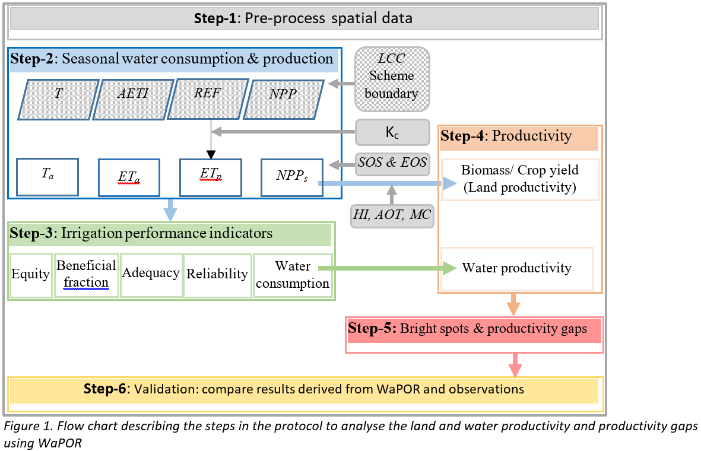

[](https://doi.org/10.5281/zenodo.3980715)

# <font color='#ff009a'> Protocole standardisé pour l'analyse de la productivité de la terre et de l'eau en utilisant WaPOR </font> 
### Version 1.1
**Amélioration de la Productivité de l'Eau dans la Pratique (Water-PIP)** 
<br/>**Preparé par IHE Delft**
<br/>**Octobre 2020**


**Auteurs:** 
* Abebe Chukalla (a.chukalla@un-ihe.org),  
* Marloes Mul, 
* Poolad Karimi

Avec la contribution de: Bich Tran, Quan Pan, Solomon Seyoum

Traduction en français par:
Aymar Y. Bossa, Ph.D.
Ozias Hounkpatin, Ph.D.
Yacouba Yira, Ph.D.

Hydro-Climate Services (HCS consultant)
Ouagadougou, Burkina Faso

# 1	Introduction 
La productivité est définié une mesure des gains par unité de ressource utilisée  (Zwart et Bastiaanssen, 2004). Pour les besoins agricoles, les indicateurs les plus importantssont sont les gains biophisiques, économiqueset sociaux comparés à la quantité de terre et d'eau utilisée. L'indicateur de productivité le plus couramment utilisé en agriculture est le rendement, qui définit le gain biophysique par unité de terre (également appelé la productivité de la terre). En raison des préoccupations croissantes concernant la disponibilité des ressources en eau, la productivité de l'eau fait l'objet d'un intérêt.

## 1.1	Importance 
Les gains croissants par unité d'eau et de terre à la fois profiteraient à l'agriculteur et au gestionnaire des périmètre aménagés, tout en étant bénéfiques au niveau du bassin.
Les agriculteurs cherchent à optimiser le bénéfice généré par unité de terre, car elle est leur principale contrainte. Alors que la première priorité de l'autorité de bassin versant est de répartir les ressources en eau de manière équitable, efficace et durable entre les différents utilisateurs/usages de l'eau. Ainsi, à l'échelle du bassin bersant, l'intérêt est d'optimiser la productivité à l'échelle du bassin tout en maintenant l'équité et la durabilité comme valeurs fondamentales. Les décideurs politiques sont souvent intéressés par l'augmentation de la production et donc du revenu national ainsi que par l'augmentation de l'emploi. 

## 1.2	Les données de WaPOR
Le portail de la FAO pour le suivi de la productivité de l'eau par l'accès libre aux produits dérivés de la télédétection (WaPOR) a été "créé pour fournir des informations pertinentes et spécifiques sur l'état de l'eau et de la biomasse afin de développer des solutions pour augmenter durablement la productivité des terres agricoles et de l'eau" . WaPOR est le premier ensemble de données complet qui combine l'utilisation de l'eau (évaporation réelle, transpiration et interception), la production (production primaire nette), l'utilisation des terres (classification de l'occupation des terres), la phénologie, le climat (précipitations et évapotranspiration de référence) et les couches de productivité de l'eau couvrant l'Afrique subsaharienne et les régions du Proche-Orient et de l'Afrique du Nord. Les données sont disponibles au pas décadaires et en temps quasi réel pour la période allant de 2009 à nos jours. Les ensembles de données WaPOR sont disponibles à l'échelle du continent (niveau 1 à 250 m), du pays et du bassin versant (niveau 2 à 100 m) et du projet (niveau 3 à 30 m). Le toute dernière version du portail de WaPOR (WaPOR v2.1), a été amélioré en comparaison à WaPOR v1.0 suite à une évaluation indépendante de la qualité réalisée par l'IHE Delft et l'ITC (FAO et IHE, 2019). La méthodologie utilisée pour compiler la base de données WaPOR est fournie dans FAO (2020a).

## 1.3	Données de terrain
Les données de terrain telles que les limites de l'exploitation (pour télécharger les données de WaPOR et filtrer les zones non cultivées), la teneur en eau de la biomasse fraîche (pour convertir la matière sèche en biomasse), la biomasse au dessus du sol sur la biomasse totale (pour estimer la biomasse au-dessus du sol), le début et la fin des saisons (pour agréger les données sur l'eau et le climat par saison de culture), l'indice de récolte (pour calculer le rendement des cultures à partir de la biomasse au-dessus du sol) et le coefficient cultural (pour estimer l'évapotranspiration potentielle à partir de l'évapotranspiration de référence) sont nécessaires.


 
## 1.4	Protocole: objectifs, portée et cible
Le protocole vise à guider les utilisateurs dans la compréhension des différentes couches contenues dans le portail de la FAO pour le suivi de la productivité de l'eau par l'accès libre aux produits dérivés de la télédétection (WaPOR) , qui peut être utilisé pour l'analyse de la productivité des terres et de l'eau. Il fournit des scripts/codes python qui peuvent être utilisés pour calculer la productivité des terres et de l'eau et d'autres indicateurs de performance tels que la consommation d'eau, la fraction bénéfique, l'équité, l'adéquation, la fiabilité ainsi que l'estimation des écarts de productivité. Pour chaque étape, le protocole fournit des informations sur les hypothèses utilisées et propose des liens vers des documents de référence.
<br/>**Portée:** Le protocole est adapté à la productivité biophysique de l'eau en ce qui concerne la consommation de l'eau et la productivité des terres dans des zones (champs et périmètre) situées dans des espaces agroclimatiques similaires. Le protocole peut être appliqué à la production végétale, indépendemment des sources d'eau (par exemple, exclusivement pluviale, ou en irrigation (augmentée par les eaux de surface et/ou souterraines, ou par les inondations /crues)). Le protocole est développé pour les zones agricoles ayant une seule culture et une même saison de culture, qui peut varier d'une année à l'autre. L'application du protocole au-delà de l'echelle des champs/périmètres, par exemple au niveau des bassins versant et des pays, qui pourraient se situer dans des zones agro-climatiques différentes, nécessite une normalisation des variations climatiques - ce qui va au delà du champ d'application du protocole. 
<br/>**Cible**: Le protocole a été développé pour les chefs de projet, les gestionnaires d'irrigation et les chercheurs qui ont une compréhension de base de python et des pratiques agricoles


# 2	Conditions d'installation
Les scripts/codes permettant de télécharger et traiter les données de WaPOR pour l'évaluation de la productivité des terres et de l'eau sont développés dans le langage de programmation python. Les scripts/codes peuvent être téléchargés à partir du repertoire de comptabilité de l'eau sur GitHub et exécutés dans Jupyter Notebook. Il est conseillé aux débutants en programmation python de suivre le cours ouvert en ligne de l'IHE Delft sur les scripts/codes python avant de commencer à appliquer les scripts/codes fournis. Un programmeur débutant devrait être capable d'exécuter les scripts/codes, il est conseillé de les exécuter en utilisant Jupyter notebook. Les sections suivantes décrivent les conditions d'installation.

## 2.1	Exécution à partir de Jupyter notebook
### Python et librairies requis pour utiliser le protocole
* python 3.7.3
* numpy 1.16.4
* pandas 0.24.2 
* GDAL 2.3.3
* pyshp 2.1.0 

## 2.1	Installer python, Jupyter notebook et les librairies (packages)
#### i) Installer python et jupyter notebook en utilisant la distribution Anaconda : https://www.anaconda.com/products/individual
Utiliser l'installateur anaconda, qui est adapté à différent système d'exploitation: window (64-Bit and 32-Bit), MacOS (64-Bit) or Linux system.
>Plus d'information sur Jupyter notebook à: https://jupyter.org/, https://packaging.python.org/overview/

#### ii) Installer les packages: 
##### Les packages tels que GDAL, pyshp peuvent être installés en utilisant pip ou conda. 
>a) **pip** installe les **packages** python dans n'importe quel environnement. **Installer un  package pip dans le (noyau) Jupyter kernel actuel**
Pip est l'outil Packaging Authority’s (Autorité de packetage) de Python recommandé pour l'installation des packages à partir de Python Package Index (PyPI), qui est un dépôt des logiciels pour la programmation dans le language Python (https://pypi.org/). Pip installe les packages python dans n'importe quel environnement. Cliquer sur le code suivant pour installer un papckage pip dans le Jupyter kernel (noyau) actuel: 
> <br/> <font color='#0d00ff'>import sys </font>
> <br/> <font color='#0d00ff'>!{sys.executable} -m pip install 'package' </font>

>b) **conda** installe tout package dans **conda environments**. **Installer un package conda dans le (noyau) Jupyter kernel actuel**
 Conda est un gestionnaire de packages et d'environnement multi-plateforme qui installe et gère les paquets conda à partir du dépôt Anaconda(https://repo.anaconda.com/) et de Anaconda Cloud (https://anaconda.org/). Conda installe tout package dans des environments conda. Cliquer sur le code suivant pour installer un papckage conda dans le Jupyter kernel (noyau) actuel:
> <br/> <font color='#0d00ff'>import sys </font>
> <br/> <font color='#0d00ff'>!conda install --yes --prefix {sys.prefix} 'package' </font>
Plus de tutoriels sur les commandes conda: https://docs.conda.io/projects/conda/en/latest/user-guide/index.html


# 3	Structure du protocole 
The protocole comprend six modules, qui sont décrits en détail dans les sections suivantes. Un notebook Jupyter a été développé pour chaque module, containant des scripts/codes. Le module 0 porte sur le téléchargement des données de WaPOR sur la consommation d'eau réelle (ET), la transpiration réelle, l'évapotranspiration de référence et la production primaire nette. Dans le module 1, les données sont prétraitées pour correspondre la résolution spatiale et supprimer les pixels non concernés. Dans le module 2, la consommation d'eau saisonnière (transpiration, évapotranspiration réelle, évapotranspiration de référence et évapotranspiration potentielle) et la production primaire nette saisonnière sont calculées. Dans le module 3, différents indicateurs de performance sont calculés. Dans le module 4, la productivité des terres et de l'eau est calculée. Enfin, dans le module 5, les zones propères et les écarts de productivité sont calculés. 



## 3.1	Télécharger les données de WaPOR (Module 0)
##### Etape 0a - Importer les modules/librairies
##### Etape 0b - Lire l'étendue géographique de la zone d'étude
##### Etape 0c - Télécharger en bloc les données de WaPOR de la zone d'étude

## 3.2	Pré-traiter les données de WaPOR (Module 1) 
##### Etape 1a - Importer les modules/librairies
##### Etape 1b - Rééchantillonner les données
##### Etape 1c - Filtrer les zone non-cultivées en utilisant la carte d'occupation des terres et les limites du projet 

## 3.3	Calcul de la consommation d'eau saisonnière & de la Production Primaire nette (Module 2) 
##### Etape 2a - Réglage: Importer les modules/librairies 
##### Etape 2b - Définition des fonctions et la saison culturale
##### Etape 2c - Calculer la T, ET, ET de Référence (RET), ETp, NPP (Production primaire nette) saisonnières

## 3.4	Calculer les indicateurs de performance (Module 3)
##### Etape 3a - Réglage 
##### Calculer l'uniformité
L'uniformité mesure l'égalité de l'apport d'eau dans les différentes portions du champ. L'équité est la mesure de l'uniformité spatiale de l'utilisation de l'eau parmi les utilisateurs, qui peuvent être des utilisateurs d'eau dans une unité tertiaire ou parmi des unités tertiaires sous un canal secondaire particulier. En l'absence de limites de parcelles ou d'unités tertiaires, l'uniformité spatiale de l'utilisation de l'eau sur la base de l'unité de surface (pixel) peut être utilisée pour mesurer l'uniformité ou l'équité. Elle est calculée comme étant le coefficient de variation (CV) de l'ETR saisonnière dans la zone d'intérêt. Un CV de 0 à 10 % est défini comme étant une bonne uniformité, un CV de 10 à 25 % comme une uniformité acceptable et un CV > 25 % comme une mauvaise uniformité.

##### Etape 3c - Calculer l'efficité (fraction bénéfique)
La Fraction Bénéfique(BF) est une mesure de l'efficacité de l'eau agricole et des pratiques agricole dans l'utilisation de l'eau pour la production culturale. Il s'agit du pourcentage de l'eau consommée sous forme de transpiration par rapport à la consommation totale d'eau du champ (ETa-ETr). 

##### Etape 3d - Calculer l'adquation
L'adequation (A) est la mesure du degré de concordance entre l'eau disponible et les besoins en eau des cultures dans un système d'irrigation (Bastiaanssen et Bos, 1999; Clemmens et Molden, 2007). Il est calculé comme l'évapotranspiration relative, qui est le rapport entre l'évapotranspiration réelle et l'évaporation potentielle (Equation 3) (Kharrou et al., 2013; Karimi et al., 2019). 

##### Step 3e Calculer le déficit hydrique relatif
Le le déficit hydrique relatif (RWD) donne une indication sur le niveau de pénurie d'eau constaté dans le système d'irrigation. Il est appliqué pour un système de monoculture, où l'ET réelle est comparée à l'ET maximale.

## 3.5	Productivité de la terre et de l'eau (Module 4)
##### Etape 4a - Réglage
##### Etape 4b - Calculer la productivité de la terre: i) de la biomasse et ii) le rendement de la culture 
La productivité dela terre est définie comme la production de biomasse au dessus du sol ou le rendement en tonnes/ha/saison.

##### Etape 4c - Calculer la : i) productivité en biomasse de l'eau et ii) la productivité culturale de l'eau
La productivité en biomasse et en culture de l'eau est estimée comme le rapport entre la biomasse au dessus du sol ou le rendement et l'évapotranspiration réelle.

## 3.6	Ecarts de productivité et projection de production (Module 5)
##### Etape 5a - Réglages
##### Etape 5b - Calculer l'objectif de productivité 
L'objectif de productivité est une cible de productivité des terres et de l'eau qui est réalisable dans les conditions climatiques locales. Cette étape du script/code décrit comment l'objectif est fixé et comment les zones prospères sont identifiées et comment l'écart de productivité (lié à l'objectif) est estimé.
L'objectif peut être fixé pour des années individuelles afin d'intégrer des conditions humides ou sèches spécifiques au cours de cette année particulière. Dans notre cas, nous avons fixé l'objectif au 95e centile de la productivité des terres ou de l'eau pour chaque année (figure 2), cela peut être modifié dans le script/code. L'ETa correspondant est également défini comme l'ETa cible.

##### Etape 5c - Identifier les zones prospères
Les zones prospères sont les champs dont la productivité des terres et de l'eau est égale ou supérieure aux objectifs. L'emplacement des zones prospères est ensuite cartographié pour les objectifs individuels (biomasse ou rendement et productivité de l'eau ainsi que les zones où les deux objectifs sont dépassés)

##### Etape 5d - calculer les écarts de productivité¶
L'écart de productivité est défini comme la différence entre la productivité au niveau de la parcelle et l'objectif de productivité. L'écart de production est défini comme la somme des écarts de productivité des terres d'une culture particulière sur une superficie donnée. L'augmentation potentielle de la production de biomasse/rendement d'une culture particulière dans une zone d'intérêt est calculée en additionnant l'écart de productivité sur l'ensemble de la zone.

# 4	Example, Protocole appliqué au périmètre irrigué de Xinavane
### 4.1	Données
Case: culture = canne à sucre, pays = Mozambique, projet = Xinavane
Les données de WaPOR et locale du Tableau 5 sont utilisées pour l'application du protocole. Les données du niveau 2 utilisées dans cette étude comprennent l'évapotranspiration et l'interception réelles ainsi que la production primaire nette à une échelle décadaire et la classification annuelle de l'occupation des terres. En outre, les précipitations décadaires ont une résolution de 5 km, l'évapotranspiration décadaire de référence à une résolution de 25 km. Les échelles des ensembles de données de précipitations et d'évapotranspiration de référence ont été reduites à une résolution de 100 m.


### 4.2	Cohérence des données de WaPOR
Il est recommandé de procéder à un contrôle de cohérence et à une validation des données de WaPOR.  

### 4.3.2	Resultats
 
 


# 5	References
Allen, R. G., Pereira, L. S., Raes, D., and Smith, M.: Crop evapotranspiration-Guidelines for computing crop water requirements-FAO Irrigation and drainage paper 56, Fao, Rome, 300, D05109, 1998.
<br/>Bastiaanssen, W. G., Van der Wal, T., and Visser, T.: Diagnosis of regional evaporation by remote sensing to support irrigation performance assessment, Irrigation and Drainage Systems, 10, 1-23, 1996.
<br/>Doorenbos, J., and Kassam, A.: FAO irrigation and drainage paper No. 33 “Yield response to water”, FAO–Food and Agriculture Organization of the United Nations, Rome, 1979.
<br/>Karimi, P., Bongani, B., Blatchford, M., and de Fraiture, C.: Global satellite-based ET products for the local level irrigation management: An application of irrigation performance assessment in the sugarbelt of Swaziland, Remote Sensing, 11, 705, 2019.
<br/>Kharrou, M. H., Le Page, M., Chehbouni, A., Simonneaux, V., Er-Raki, S., Jarlan, L., Ouzine, L., Khabba, S., and Chehbouni, G.: Assessment of equity and adequacy of water delivery in irrigation systems using remote sensing-based indicators in semi-arid region, Morocco, Water resources management, 27, 4697-4714, 2013.
<br/>Smith, D., Inman-Bamber, N., and Thorburn, P.: Growth and function of the sugarcane root system, Field Crops Research, 92, 169-183, 2005.
<br/>Villalobos, F. J., and Fereres, E.: Principles of agronomy for sustainable agriculture, Springer, 2016.
<br/>WaPOR: The FAO portal to monitor Water Productivity through Open access of Remotely sensed derived data, 23 October, FAO, Rome, Italy, 2019.
<br/>Yilma, W. A., Opstal, J. V., Karimi, P., and Bastiaanssen, W.: Computation and spatial observation of water productivity in Awash River Basin, UNESCO-IHE, Delft, 2017.
<br/>Zwart, S. J., and Bastiaanssen, W. G.: Review of measured crop water productivity values for irrigated wheat, rice, cotton and maize, Agricultural water management, 69, 115-133, 2004.


```python

```
