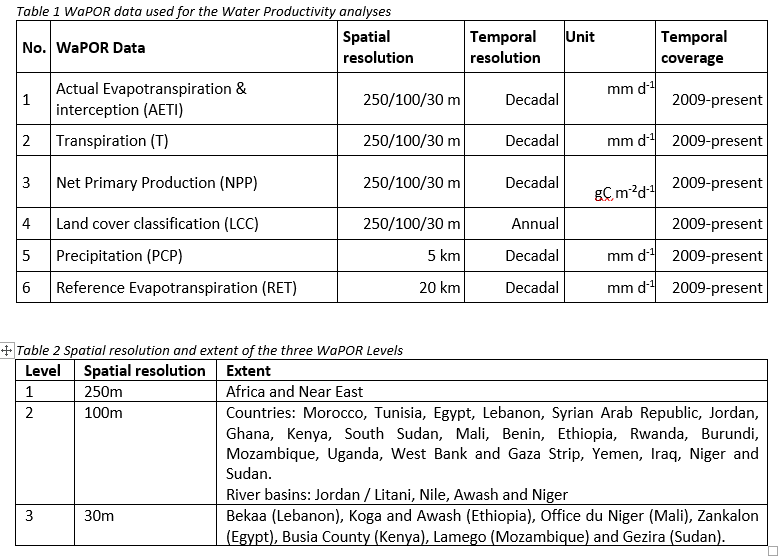
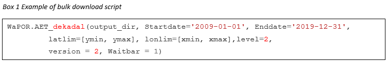
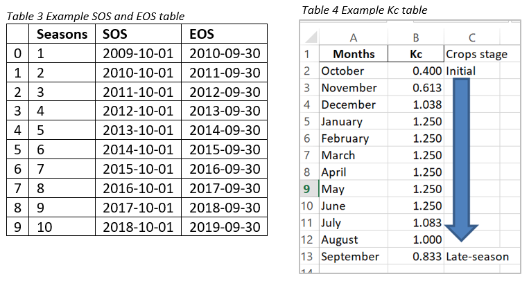
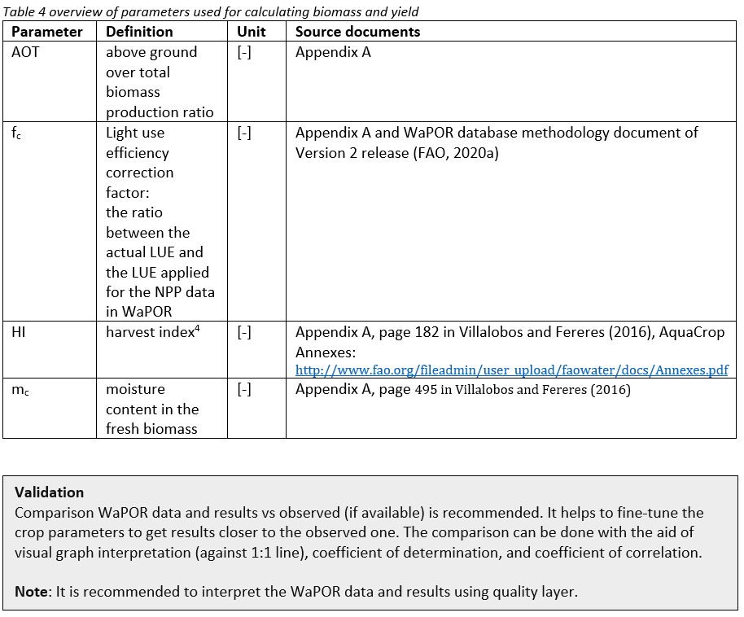
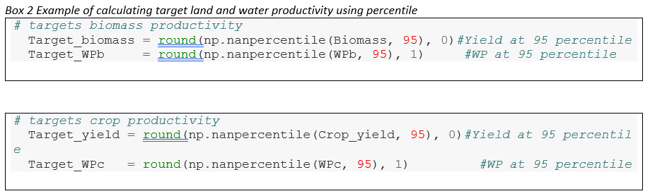

[](https://doi.org/10.5281/zenodo.3980715)

# <font color='#ff009a'> Standardized protocol for land and water productivity analyses using WaPOR</font> 
### Version 1.1
**Water Productivity Improvement in Practice (Water-PIP)** 
<br/>**Prepared by IHE Delft**
<br/>**October 2020**


**Authors:** 
* Abebe Chukalla (a.chukalla@un-ihe.org),  
* Marloes Mul, 
* Poolad Karimi

With contributions from: Bich Tran, Quan Pan, Solomon Seyoum


# 1	Introduction 
Productivity is defined as a measure of gains per unit of resource use (Zwart and Bastiaanssen, 2004). For agriculture purposes, the most important indicators are biophysical, economic or social gains compared to the amount of land and water used. The most commonly used productivity indicator in agriculture is yield which defines the biophysical gain per unit of land (also called land productivity). With increasing concerns about the available water resources, water productivity has gained interest.  

## 1.1	Importance 
The increased gains per unit of water and land would benefit the farmer and scheme manager as well as being beneficial at the basin level.

Farmers often aim to maximize the benefit generated per unit of land, as this is their main constraint. While the top priority of the river basin authority is to allocate water resources in an equitable, efficient, and sustainable manner between different water uses/ users. Thus, at the river basin level, the interest is to optimize the productivity of water use while maintaining equity and sustainability as core values. Policymakers are often interested to increase production and thus national income as well as increase employment.  

## 1.2	WaPOR data
FAO’s portal to monitor Water Productivity through Open-access of Remotely sensed derived (WaPOR) was “created to provide relevant and specific information on water and biomass status to develop solutions to sustainably increase agricultural land and water productivity” . WaPOR is the first comprehensive dataset that combines water use (actual evaporation, transpiration and interception), production (net primary production), land use (land cover classification), phenology, climate (precipitation and reference evapotranspiration) and water productivity layers covering sub-Saharan Africa and the Near East and North African regions. The data is available at decadal time steps and in near real-time for the period between 2009 to present day. WaPOR datasets are available at the continental scale (Level 1 at 250 m), country and river basin (Level 2 at 100 m) and project level (Level 3 at 30 m). The latest WaPOR portal (WaPOR v2.1), was improved from WaPOR v1.0 following the independent quality assessment by IHE Delft and ITC (FAO and IHE, 2019). The methodology used for compiling the WaPOR database is provided in FAO (2020a).  

## 1.3	Ground data
Ground data such as the boundary of the farm (to download WaPOR data and filter non cropped area), moisture content of fresh biomass (to convert dry matter to biomass), above ground over total biomass (to estimate the above ground biomass), start and end of seasons (to aggregate water and climate data per crop season), harvest index (to derive crop yield from above ground biomass) and crop coefficient (to estimate potential evapotranspiration from reference evapotranspiration) are required. 
 
## 1.4	Protocol: objectives, scope and target audience
The protocol is aimed at guiding users to understand the different layers contained in the FAO Water Productivity Open-access portal (WaPOR) which can be used for land and water productivity analyses. It provides python scripts which can be used to calculate land and water productivity and other performance indicators such as uniformity, efficiency (beneficial fraction), adequacy, relative water deficit as well as estimating productivity gaps. For each step, the protocol provides information about the assumptions used and provides links to reference materials.  
<br/>**Scope:** The protocol is tailored to biophysical water productivity with respect to consumed water use and land productivity at areas (fields, and schemes) in similar agro-climatic zones. The protocol can be applied to single water management unit and crop production regardless of the water sources (e.g. from exclusively rainfall (rainfed), or irrigation (augmented through surface water and/or groundwater, or flood /spate)). The protocol is developed for agricultural areas with a single crop and same cropping season, which can vary between years. Implementing the protocol beyond fields/ scheme level such as a river basin and country levels, which could fall in different agro-climatic zones, require normalization for climate variation – which is outside the scope of the protocol.     
<br/>**Target**: The protocol is developed for project leads, irrigation managers and researchers who have a basic understanding of python and agricultural practices.   

# 2	Installation requirements
The scripts to download and process the WaPOR data for land and water productivity assessment are developed in the python programming language. The scripts can be downloaded from the water accounting repository on GitHub  and run in Jupyter Notebook. Beginners of python programming are advised to follow the OCW of IHE Delft on python scripting before starting with implementing the provided scripts . A beginning programmer should be able to run the scripts, it is advised to run them using Jupyter notebook. The following sections describe the installation requirements.  
## 2.1	Running from Jupyter notebook
### The requirement of the python and libraries used in the protocol
* python 3.7.3
* numpy 1.16.4
* pandas 0.24.2 
* GDAL 2.3.3
* pyshp 2.1.0 

## 2.1	Install python, Jupyter notebook and libraries (packages)
#### i) Install python and jupyter notebook using the Anaconda distribution: https://www.anaconda.com/products/individual
Use the anaconda installer, which is tailored to different operating system: window (64-Bit and 32-Bit), MacOS (64-Bit) or Linux system.
>Read more on Jupyter notebook: https://jupyter.org/, https://packaging.python.org/overview/
**Steps to run Jupyter notebook** refer from https://github.com/wateraccounting/WAPOROCW/blob/master/README.md

#### ii) Install packages: 
##### Packages such as GDAL, pyshp can be installed using pip or conda. 
>a) **Pip** is the Python Packaging Authority’s recommended tool for installing packages from the Python Package Index (PyPI), which is a repository of software for the Python programming language (https://pypi.org/). Pip installs python packages in any environment. Type the following codes to Install a pip package in the current Jupyter kernel: 
> <br/> <font color='#0d00ff'>import sys </font>
> <br/> <font color='#0d00ff'>!{sys.executable} -m pip install 'package' </font>

>b) **Conda** is a cross platform package and environment manager that installs and manages conda packages from the Anaconda repository (https://repo.anaconda.com/) and the Anaconda Cloud (https://anaconda.org/). Conda installs any package in conda environments. Type the following codes to Install a conda package in the current Jupyter kernel:
> <br/> <font color='#0d00ff'>import sys </font>
> <br/> <font color='#0d00ff'>!conda install --yes --prefix {sys.prefix} 'package' </font>
More tutorials on **conda** commands: https://docs.conda.io/projects/conda/en/latest/user-guide/index.html
> <br/> Example: screen shot of installing gdal package


# 3	Structure of the protocol 
The protocol has six modules, which are described in detail in the following sections. For each of the modules, a Jupyter notebook was developed, containing the scripts. Module 0 focuses on downloading WaPOR data on actual water consumption (ET), actual transpiration, reference evapotranspiration and net primary production. In Module 1, the pre-processing of the data to match the spatial resolution and remove non-crop pixels is conducted. In Module 2, the seasonal water consumption (transpiration, actual evapotranspiration, reference evapotranspiration and potential evapotranspiration) and seasonal net primary production are computed. In Module 3, different performance indicators are calculated. In Module 4, land and water productivity are computed. And finally in Module 5, bright spots and productivity gaps are calculated.  

,  

**Figure 1.** Flow chart for downloading WaPOR data and calculate performance indicators, land and water productivity and productivity gaps (Left) and a screenshot of the Jupyter notebook for the six modules (Right). 

## 3.1	Download WaPOR data (Module 0)
**Notebook:** https://github.com/wateraccounting/WAPORWP/blob/master/Notebooks/Module_0_WaPOR_data_bulk_download.ipynb
##### Step 0a Import modules/libraries
##### Step 0b Read the geographical extent of the study area
##### Step 0c Bulk-download WaPOR data for the study area extent
The main objective of this module is to download the relevant data for the water productivity analysis protocol in the correct units. For these analyses, we need to download 6 different WaPOR layers (Table 1). The precipitation and reference evapotranspiration layer are available at 5 and 20 km resolution respectively. The other four layers, actual evapotranspiration and interception, transpiration, net primary production and land cover classification are all available at three different resolutions (250, 100 and 30 m). All layers, except land cover classification, are available at decadal, monthly and yearly temporal resolution. The land cover classification at 30 m is available at decadal and annual resolution; and at 250 and 100 m resolution it is available at annual resolution. For the analyses we are using the decadal data set, except land cover classification is annual data set. The WaPOR data is available for Africa and the Near East at 250 m resolution. The availability of the higher resolution data (100 and 30m) is dependent on your location (Table 2).

  

The scripts in this step first determine the geographical extent of the study area. By reading the shapefile of the area, it will use the outer extent to download the relevant data. The scripts for the bulk download correct the data for the conversion factor and correct for the units from an average daily value to the total amount in a decade by multiplying by the number of days in a decade. An example of the download script is provided in box 1. 

 

The script is pre-set at downloading decadal data from 1 January 2009 to 31 December 2019 and for level 2. These settings can be manually changed to fit your purpose. One can adjust the dates. If there is no level 2 data available at your site, or you have level 3 data available you can change the setting. There is also a facility to directly download monthly and yearly data, this can be done by changing the extension ‘decadal’ to ‘monthly’ or ‘yearly’. The script is pre-set to download WaPOR version 2, if there is another version available this can be easily changed. The settings which can be changed are highlighted red in box 1.


## 3.2	Pre-processing WaPOR data (Module 1) 
**Notebook:** https://github.com/wateraccounting/WAPORWP/blob/master/Notebooks/Module_1_WaPOR_data_preparation.ipynb
##### Step 1a Import modules/libraries 
##### Step 1b Resample raster data 
##### Step 1c Filter non-cropped area using land cover map and project boundary 
 
The main objective of this module is to prepare the data for analyses. Firstly, all data is sampled to the same resolution, even though many of the datasets are available at the same resolution, more coarse data such as reference evapotranspiration and precipitation need to be resampled. 
In the example case, we identified the area for analysis using a shapefile (project boundary) to crop out the area of investigation, this is followed by a procedure to mask out non-irrigated areas. Of course there are different ways to extract the area for analyses, which can be applied, but these are not elaborated upon in this protocol. 
For the analyses it is important to select a homogeneous area with one single crop type and similar crop season. 

## 3.3	Computing Seasonal Water Consumption & Net Primary Production (Module 2) 
**Notebook:** http://localhost:8888/notebooks/Module_2_SeasonalWaterConsumption%26NetPrimaryProduction.ipynb
##### Step 2a Set up: Import modules/libraries 
##### Step 2b Defining function and crop season
##### Step 2b Calculate seasonal T, ET, RET, ETp, NPP 
For agricultural purposes the seasonal values are important, these are calculated by summing the decadal amounts over a specified cropping season, defined by a start and end of crop season (SOS and EOS). The SOS and EOS are user-defined. Table 3 shows an example of such a crop season table which is used for the calculations. Table 3 is input data in excel format (df_SosEos.xlsx), which is read into Module 2 of the script.  Users could edit the dates (starting of season (SOS) and ending of season (EOS)).  The rows should end on the last month of the ending of season (EOS). ETp is calculated by multiplying crop coefficient (Kc) by reference evapotranspiration at monthly as well as seasonal time steps. Edit only the **Kc** values and the corresponding **Months** in the **df_Kc.xlsx** file in the data folder (Table 4), which is read into Module 2 of the script. The rows should end on the last month of the late-season stage.


## 3.4	Calculate performance indicators (Module 3)
**Notebook:** http://localhost:8888/notebooks/Module_3_CalculatePerformanceIndicators.ipynb
This module is used to calculate a number of performance indicators, namely uniformity, beneficial fraction, adequacy and relative water deficit.  
##### Step 3a Set up 
##### Step 3b Calculate Uniformity and Equity
Uniformity measures the evenness of the irrigation application in different parts of a field. This can be calculated by assessing the spatial uniformity of seasonal ET pixels that are within a field or plot of land.
Equity is the measure of equitable distribution of water to different users (i.e. farmers), which can be water users at a tertiary unit or among tertiary units under a particular secondary canal. Ideally, for equity, pixel values must be aggregated and averaged per field (or a block if comparisons are made between blocks), to arrive with an average seasonal ET per unit of area in each field. The coefficient variation of these values would then can be taken as an indication of equity in the scheme. In the absence of plot (or block) boundaries, the spatial uniformity of evapotranspiration per unit area (pixel) bases can be used to measure uniformity or equity. It is calculated as the coefficients of variation (CV) of seasonal ETa in the area of interest. A CV of 0 to 10 % is defined as good uniformity, CV of 10 to 25 % as fair uniformity and CV > 25 % as poor uniformity (Bastiaanssen et al., 1996; Molden and Gates, 1990; Karimi et al., 2019).


##### Step 3c Calculate Efficiency (Beneficial fraction)
Beneficial fraction (BF) is an indication of the efficiency of on-farm water and agronomic practices in converting water use to crop growth. It is the percentage of the water that is consumed as transpiration compared to overall field water consumption (ETa).  

##### Step 3d Calculate Adequacy
Adequacy (A) is the measure of the degree of agreement between available water and crop water requirements in an irrigation system (Bastiaanssen and Bos, 1999; Clemmens and Molden, 2007). It is calculated as the relative evapotranspiration, which is the ratio of actual evapotranspiration over potential evaporation (Equation 3) (Kharrou et al., 2013; Karimi et al., 2019). Potential evaporation is estimated as the product of average kc and RET.   

##### Step 3e Calculate Relative Water Deficit
Relative Water Deficit (RWD) provides an indication of the level of water shortage found in the irrigation system. It is calculated using the equation described in FAO 66 (Steduto et al., 2012) by applying for a mono-crop system, where the actual ET is compared to the maximum ET.

## 3.5	Land and water productivity (Module 4)
**Notebook:** http://localhost:8888/notebooks/Module_4_CalculateLand%26WaterProductivity.ipynb
##### Step 4a Set up 
##### Step 4b Calculate land productivity: i) biomass and ii) crop yield
**Land productivity** is is defined as the above-ground biomass production or yield in ton/ha/season, which are estimated from the seasonal net primary production using the following equations: 

The parameters used in these equations are crop-specific and vary under different climatic conditions. There are several resource documents that can be consulted to obtain these parameters (Table 4). It is important to keep in mind that these parameters are based on literature and therefore stresses and management practices affecting the HI and mc cannot be incorporated. If there is local information, it is better to use that information.  


##### Step 4c Calculate i) biomass water productivity and ii) crop water productivity
**Biomass and crop Water productivity** is estimated as the ratio of above-ground biomass or yield over actual evapotranspiration. 

## 3.6	Productivity gaps and production projection (Module 5)
**Notebook:** http://localhost:8888/notebooks/Module_5_BrightSpots%26ProductivityGaps.ipynb
##### Step 5a Set up 
##### Step 5b Calculate the target productivity
The **target productivity** is a target for land and water productivity which is attainable under the local climatic conditions. This step of the script describes how the target is set and how bright spots are identified and how the productivity gap (related to the target) is estimated.
The target can be set for individual years to incorporate specific wet or dry conditions during that particular year. In our case we set the default target at the 95 percentile of the land or water productivity for each year, this can be changed in the script. The corresponding ETa is also defined as the target ETa.


##### Step 5c Identify bright spots 
The **bright spots** are fields that have both land and water productivity equal to or greater than the targets. The location of the bright spots is then mapped for the individual targets (biomass or yield and water productivity as well as areas where both targets are exceeded. 
##### Step 5d Calculate productivity gaps¶
**Productivity gap** is defined as the difference between productivity at the plot level and the target productivity; it is the maximum value from zero and target productivity minus the productivity at plot level. The production gap is defined as the sum of the land productivity gaps of a particular crop over area. The potential increase in biomass/ yield production of a particular crop in an area of interest is calculated by adding the productivity gap across the area. 

# 4	Example, Protocol applied at Xinavane irrigation scheme
### 4.1	Data
Case: crop = sugarcane, country = Mozambique, project = Xinavane
WaPOR and local data of Table 6 are used to implement the protocol. The Level 2 data used in this study include actual evapotranspiration and interception and net primary production at a decadal timescale and annual land cover classification. In addition, decadal precipitation at 5 km resolution, decadal reference evapotranspiration at 25 km resolution. The precipitation and reference evapotranspiration datasets were downscaled to 100 m resolution.


### 4.2	WaPOR data consistency 
The Level 2 data source of the WaPOR data is not consistent throughout the 10 years. Before 2014, the data is derived from the MODIS satellite (250 m resolution), which is resampled to 100 m. In 2014, PROBA-V came into orbit, which provides the WaPOR L2 data for the period after 2014. The analyses in this report show a clear break 2009-2013 and 2014 onwards in the data (e.g., the noise in the biomass-transpiration and biomasses relationship are much even with patch of scatter pixels, such as high biomass at zero transpiration which cannot be explained agronomical).   

### 4.3.2	Results
 
 


# 5	References
Allen, R. G., Pereira, L. S., Raes, D., and Smith, M.: Crop evapotranspiration-Guidelines for computing crop water requirements-FAO Irrigation and drainage paper 56, Fao, Rome, 300, D05109, 1998.
<br/>Bastiaanssen, W. G., Van der Wal, T., and Visser, T.: Diagnosis of regional evaporation by remote sensing to support irrigation performance assessment, Irrigation and Drainage Systems, 10, 1-23, 1996.
<br/>Doorenbos, J., and Kassam, A.: FAO irrigation and drainage paper No. 33 “Yield response to water”, FAO–Food and Agriculture Organization of the United Nations, Rome, 1979.
<br/>Karimi, P., Bongani, B., Blatchford, M., and de Fraiture, C.: Global satellite-based ET products for the local level irrigation management: An application of irrigation performance assessment in the sugarbelt of Swaziland, Remote Sensing, 11, 705, 2019.
<br/>Kharrou, M. H., Le Page, M., Chehbouni, A., Simonneaux, V., Er-Raki, S., Jarlan, L., Ouzine, L., Khabba, S., and Chehbouni, G.: Assessment of equity and adequacy of water delivery in irrigation systems using remote sensing-based indicators in semi-arid region, Morocco, Water resources management, 27, 4697-4714, 2013.
<br/>Smith, D., Inman-Bamber, N., and Thorburn, P.: Growth and function of the sugarcane root system, Field Crops Research, 92, 169-183, 2005.
<br/>Villalobos, F. J., and Fereres, E.: Principles of agronomy for sustainable agriculture, Springer, 2016.
<br/>WaPOR: The FAO portal to monitor Water Productivity through Open access of Remotely sensed derived data, 23 October, FAO, Rome, Italy, 2019.
<br/>Yilma, W. A., Opstal, J. V., Karimi, P., and Bastiaanssen, W.: Computation and spatial observation of water productivity in Awash River Basin, UNESCO-IHE, Delft, 2017.
<br/>Zwart, S. J., and Bastiaanssen, W. G.: Review of measured crop water productivity values for irrigated wheat, rice, cotton and maize, Agricultural water management, 69, 115-133, 2004.


```python

```
